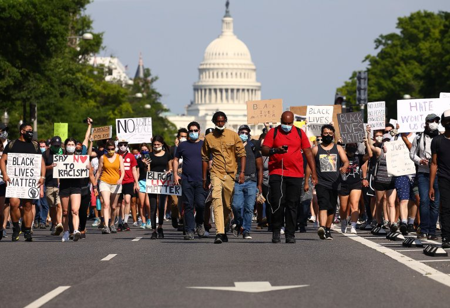

# Protests analysis

## Introduction
- *[The FBI Warned Of Armed Protest At State Capitols. In Colorado, Nothing Much Has Materialized](https://www.cpr.org/2021/01/17/the-fbi-warned-of-armed-protest-at-state-capitols-in-colorado-nothing-much-has-materialized/)*

_**In Colorado, different citizens, including a man with a white beard poking out from his ‘Trump 2020’ mask chatted with reporters, expressed their dissatisfaction with the election results in their own ways. They want Trump to run again in 2024.**_

- *[‘Unprecedented’ show of force meets modest protest at Utah Capitol Sunday](https://www.deseret.com/utah/2021/1/17/22233922/government-election-protest-group-marches-on-capitol-in-salt-lake-city-donald-trump-joe-biden)*

_**Large protests took place at the Utah Capitol Sunday, where people who support both political parties fought fiercely. Some people think Trump was wise not to be elected, saying “we do not support the dictator Donald Trump in office. ... This is the easiest state of emergency I’ve ever witnessed.”But some say the election results are not good, and some people even said that“(I’m) just trying to support Trump because he got railroaded,”“Something was not right (with the election) and Pelosi was the instigator. Pelosi’s on cloud nine now.The FBI has a “heightened posture” heading into the weekend and through Jan. 20, Inauguration Day for Biden.**_

- *[The Capitol insurrection could be a bigger racial reckoning than the George Floyd protests](https://www.cnn.com/2021/01/17/us/capitol-riot-racial-justice-blake/index.html)*

_**The protests at the Capitol shed light on racial discrimination.It's true that Trump remains the most dominant force in the Republican Party. It may be premature to write his political obituary. But the stain of the Capitol riot may follow him, his family and their supporters in Congress for the rest of their lives.There are leading some results:It's redefined White supremacy as a form of treason;It could boost international pressure on the US to make changes;It could bring sweeping federal legislation, and it will force America to choose a vision for its future.**_

## Picture

**Demonstrators march down Pennsylvania Avenue near the Trump International Hotel during a protest against police brutality and the death of George Floyd, on June 3, 2020 in Washington, D.C.In this picture, there are people of different races and colors representing their different reactions and stances in the protest.**

# Reflections
- Reflection 1

Because mean is larger than median, distribution is skewed instead of normalize Path, it skewed to the right.
If Mean>Median>mode, the data distribution belongs to the positive skew distribution. The characteristic of a positive skew distribution is that the highest point of the curve is tilted to the left of the X-axis, the curve on the left half is steeper than the curve on the normal half, and the curve on the right half is gentler than the curve on the left half, and its tail line is longer than the curve on the left half, and goes on indefinitely until it reaches the X-axis.

- Reflection 2

We assume that each state has a certain number of protested events.
1/(total number of states in the US)*100
1/50*100=2%
According to the the protest percentage in the Washington
We know the answer is 3.6%, which is larger than the average number of protests in other states(2%). Its activity in protests is higher than the average activity across the states.
Plus, I list an example to prove my view. Here is the [link:](https://www.foxnews.com/us/protesters-gathered-outside-capitol-in-olympia-washington)

- Reflection 3

I think there are two problems.
Firstly, there are some potentially wrong data, since 'te' and 'ce' are not states.
We cannot add them to the states list to calculate the number of protests.
Additionally, the states names are inconsistent in format. We need to cast all the state names to capital letter, like 'wa' and 'WA' are different things recognized by R but they actually mean the same state. Using the lower case may cause some errors in the protests calculation.
solutions:1.Using the upper case to show states. 2.Getting rid of any states that use the wrong expression (or remove any lines with wrong data).

- Reflection 4

Although 2020 is nearly twice as many as 2019, I think it's understandable. Since 2020 is an election year, there will naturally be more protests.

- Reflection 5

- [Revitalizing US Democracy Starts with Repairing the Right to Peaceful Assembly](https://www.justsecurity.org/73689/revitalizing-us-democracy-starts-with-repairing-the-right-to-peaceful-assembly/)

The Biden administration should also move to reform federal legislation that is used in an overly broad manner to prosecute those involved in protests, particularly the Federal Anti-Riot Act, describing people who incite ,organize, promote, encourage, participate or carry on a riot would fined or imprisoned not more than five years, or both.

- [Restricting Tear Gas, Rubber Bullets, and Other Less Lethal Weapons](https://www.icnl.org/post/analysis/us-legislative-briefer-less-lethal-weapons)

The government has restricted the use of some weapons in an effort to reduce shootings in the protests, including tear gas, rubber bullets, and sonic weapons.

- Reflection 6

As is shown by the table,I think citizens in the US pay much attention in the Racial Injustice(10610),which is larger than others - people care the most about now (maybe the issue that people are unsatisfied with the most)

# Questions
- What results from the analysis surprised you? Why?

I was struck by the number of protests that has doubled between 2019 and 2020, and the negative impact it has had on the nation's development.

- What parts of the analysis did you find most challenging?

Well,I think create a variable `high_level_purposes` is the most difficult part, and I almost spend one hour to fix this problem.I had the difficulty when I create the symbol of ("\\s*\\([^\\)]+\\),and it is my first time to use gsub.

- What kind of analysis do you wish you were able to do with the dataset (but perhaps don't have the technical skills to do so)?

I want to explore the relationship between time (month in a year) and the surge in the number of protests for different purposes.I think the distribution of it will be found by the dataset.
